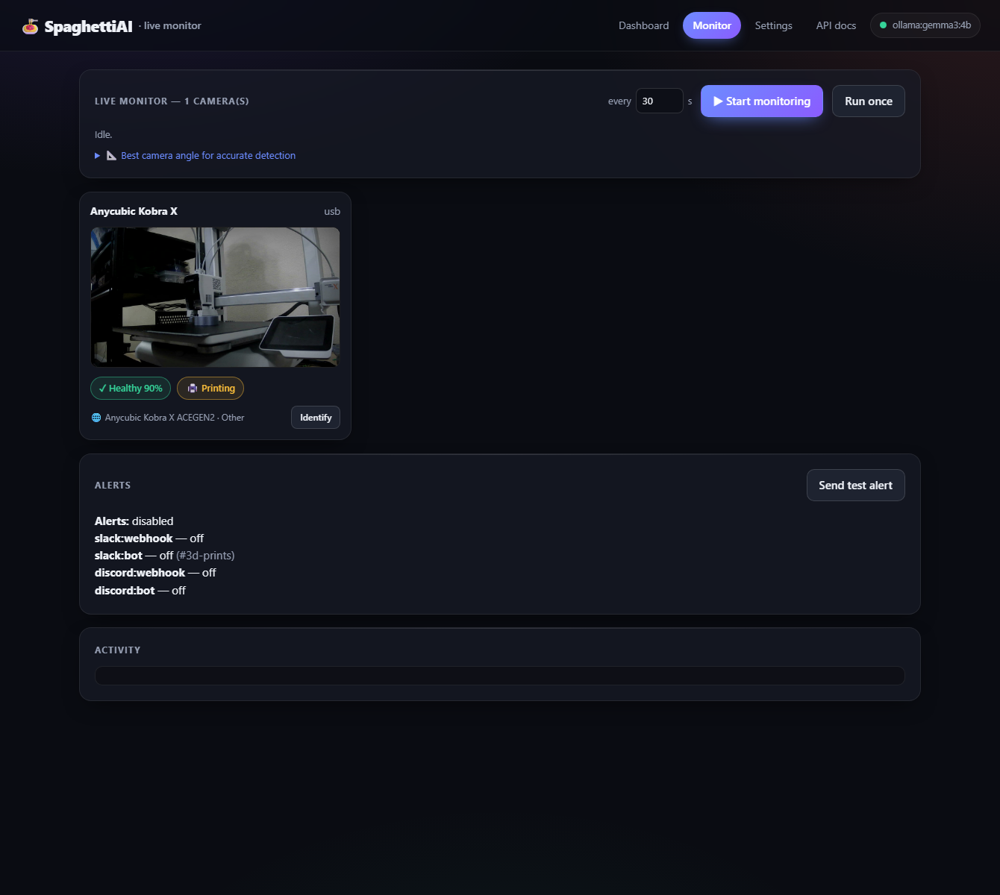

<div align="center">

# 🍝 SpaghettiAI

**Point a webcam at your 3D printer and let a local vision model catch the spaghetti — and help you fix it.**

[](LICENSE)
[](https://nodejs.org)
[-black.svg)](https://ollama.com)
[](CONTRIBUTING.md)

No cloud · no API keys · no images leave your machine (unless you opt into Gemini).

<br>



</div>

---

### ⬇️ Install on Windows (one line)

Download and launch the latest prebuilt installer — paste into **PowerShell**:

```powershell
[Net.ServicePointManager]::SecurityProtocol=[Net.SecurityProtocolType]::Tls12; $u='https://github.com/amosroger91/SpaghettiAI/releases/download/v1.0.0/SpaghettiAI-Setup-1.0.0.exe'; $o="$env:TEMP\SpaghettiAI-Setup-1.0.0.exe"; Invoke-WebRequest $u -OutFile $o -UseBasicParsing; Start-Process $o
```

> The `Tls12` prefix is needed on **Windows PowerShell 5.1** (its default TLS is too old for GitHub's download CDN); harmless on PowerShell 7+.

Prefer to build from source or run on macOS/Linux/Docker? See [Quick start](#quick-start) and [Run it your way](#run-it-your-way).

---

> **If you've been looking for a good use case for AI as a print farm owner, this is it.**
> A local vision model watching every camera, catching spaghetti, reading the bed, and
> answering "how's the farm?" from a chat client — running entirely on hardware you own,
> with [nothing but a single text search ever leaving the machine](#privacy--offline-use).

## What it does

| | |
|---|---|
| 🔎 **"Has this print failed?"** | An on-demand health check with a real **double-check**: it votes across multiple model passes *and* multiple frames seconds apart, so glare, a moving nozzle, or one bad guess don't trigger false alarms. When a failure *is* suspected, an optional **second-opinion jury** of other local models votes to confirm it — or veto a false alarm — before you're alerted. |
| 🛠️ **"Why did it fail?"** | The model diagnoses your symptom, proposes concrete changes each with a **visually verifiable** success signal, then watches a later snapshot (before vs. after) to confirm the fix actually worked. |
| 🟢 **"What's on the bed?"** | A one-click read of the printer's state — **empty/clean**, **printing**, **complete** (finished part ready to remove), or **failed** — voted across passes the same way. |
| 🖨️ **"What printer is this?"** | Identifies the machine in view: motion style (bed-slinger / CoreXY / delta) and enclosure, plus make/model. It **reads the branding off the machine and looks it up online** to name the exact printer instead of guessing (e.g. `ACE GEN2` → Anycubic Kobra X). |
| 📺 **Live monitor** | A grid dashboard that streams **every camera** at once and re-checks health + bed state on an interval, so you can watch a whole print farm from one tab. |
| 🔔 **Alerts** | Get a **Slack or Discord** ping the moment a failure is detected — webhook or bot, per channel. |
| 🎥 **OctoPrint feed** | Re-serves any camera in **mjpg-streamer format**, so a USB cam on this box becomes an OctoPrint webcam. |
| 📱 **Phone as a camera** | **No webcam? Use an old phone.** Scan a QR, and the phone streams its camera in — it becomes a normal camera (checks, bed state, alerts) and can even be re-served to OctoPrint. |
| 🤖 **MCP server** | Optional [MCP](https://modelcontextprotocol.io) server — drive everything from Claude or any MCP client by voice/chat. |

Run it however you like: **`npm run dev`**, a one-click **desktop app** (Electron), or **Docker** for a headless box watching many cameras.

## Contents

- [Quick start](#quick-start)
- [Configure your cameras](#configure-your-cameras)
- [Live monitor](#live-monitor)
- [Alerts](#alerts)
- [Use a phone as a camera](#use-a-phone-as-a-camera) (turn an old phone into a printer monitor)
- [Feed OctoPrint](#feed-octoprint) (use a USB cam as an OctoPrint webcam)
- [Run it your way](#run-it-your-way) (desktop · Docker)
- [MCP server](#mcp-server) (use it from Claude / any MCP client)
- [Choosing a model](#choosing-a-model)
- [Printer & bed state](#printer--bed-state)
- [How it works](#how-it-works)
- [Privacy & offline use](#privacy--offline-use) (and air-gapped setups)
- [Tuning & accuracy](#tuning--accuracy)
- [API](#api)
- [Contributing](#contributing)

## Quick start

```bash
git clone https://github.com/amosroger91/SpaghettiAI.git
cd SpaghettiAI
npm install
npm run setup    # installs Ollama if needed, starts it, pulls the vision model
npm run dev
```

`npm run setup` is the automated path — it installs Ollama (winget / Homebrew /
install.sh), launches it, and pulls the model (`gemma3:4b` by default, or `$PW_MODEL`).
Already have Ollama? It just checks and pulls the model. Prefer to do it by hand?
`ollama pull gemma3:4b` is all you need. Standalone scripts also live in
[`scripts/`](scripts) (`setup-ollama.ps1`, `setup-ollama.sh`).

Then open:

- **http://127.0.0.1:8787** — the dashboard (single-camera check / troubleshoot)
- **http://127.0.0.1:8787/monitor** — the [live monitor](#live-monitor) grid (all cameras)
- **http://127.0.0.1:8787/docs** — interactive [API docs](#api) (Swagger UI)

The dashboard loads even before a camera is configured — set one in `config.json` (below).

## Configure your cameras

Cameras live in the `cameras` array in `config.json` — **add as many as you like and mix
types freely**. Each entry has an `id` (used in the API as `?camera=id`), a `label`, a
`type`, and that type's field:

```jsonc
"cameras": [
  { "id": "kobra",  "label": "Anycubic Kobra X", "type": "usb",           "usbDevice": "video=USB 2.0 Camera" },
  { "id": "ender",  "label": "Ender 3",          "type": "mjpeg",         "url": "http://octopi.local/webcam/?action=stream" },
  { "id": "prusa",  "label": "Prusa MK4",        "type": "http-snapshot", "url": "http://prusa.local/snapshot" },
  { "id": "bench",  "label": "Bench cam",        "type": "folder",        "folderPath": "./incoming" }
]
```

| `type`          | Use it for                                                | Set         |
|-----------------|-----------------------------------------------------------|-------------|
| `http-snapshot` | OctoPrint `?action=snapshot`, mjpg-streamer, any JPEG URL | `url`       |
| `mjpeg`         | An MJPEG stream (OctoPrint `?action=stream`)              | `url`       |
| `usb`           | A webcam on this machine (needs `ffmpeg`)                  | `usbDevice` |
| `folder`        | A directory other tools drop snapshots into               | `folderPath`|

> **OctoPrint users:** the webcam is just a normal MJPEG/snapshot endpoint —
> point `http-snapshot` at `http://<octoprint-host>/webcam/?action=snapshot`.
> The legacy single `camera: { … }` object still works — it's folded into `cameras` automatically.

### USB webcam on the host PC

For a webcam plugged straight into the machine running SpaghettiAI, set `camera.type`
to `usb` and `camera.usbDevice` to the device's `ffmpeg` name. Frames are grabbed with
[`ffmpeg`](https://ffmpeg.org), so it must be installed (`winget install Gyan.FFmpeg`,
`brew install ffmpeg`, or your distro's package).

List your devices, then copy the name into `usbDevice`:

```bash
# Windows (DirectShow)
ffmpeg -list_devices true -f dshow -i dummy      # → usbDevice: "video=USB 2.0 Camera"
# macOS (AVFoundation):  usbDevice "0"   ·   Linux (V4L2):  usbDevice "/dev/video0"
```

If `ffmpeg` isn't on your `PATH` (e.g. a fresh install in an already-open terminal),
point at it with `camera.ffmpegPath` or the `PW_FFMPEG` env var.

Env overrides (no file edit needed): `PW_CAMERA_URL` · `PW_CAMERA_TYPE` · `PW_MODEL` ·
`PW_OLLAMA_URL` · `PW_PORT` · `PW_FFMPEG` · `PW_AI_PROVIDER` · `PW_GEMINI_API_KEY`
(single-camera vars apply to the first camera).

## Live monitor

**http://127.0.0.1:8787/monitor** is a grid that streams **every configured camera** and,
on a timer you set, re-runs the failure check and bed-state read on each — turning a pile
of webcams into one glanceable wall.

- Set the interval (default **30 s**), hit **Start monitoring**, or **Run once**.
- Each tile shows a live frame + colour-coded **health** and **bed** badges, and an
  **Identify** button for printer detection.
- Cameras are checked independently, so one printer alerting doesn't stop the others.

> A full 2×2 failure check on a 4B CPU model takes a couple of minutes; the loop waits for
> a cycle to finish before the next, so the interval is the *gap between* cycles. For many
> cameras or snappier ticks, lower `check.samples`/`check.frames` or use a GPU.

## Alerts

Get pinged when a failure (or, optionally, an *uncertain* verdict) is detected. **Slack and
Discord** are supported, each as a **webhook** *or* a **bot (API token)**. Configure under
`alerts` in `config.json` — but **keep secrets out of the file**; prefer env vars:

| Channel             | Env vars                                            |
|---------------------|-----------------------------------------------------|
| Slack webhook       | `PW_SLACK_WEBHOOK`                                  |
| Slack bot           | `PW_SLACK_BOT_TOKEN` + `PW_SLACK_CHANNEL`           |
| Discord webhook     | `PW_DISCORD_WEBHOOK`                                |
| Discord bot         | `PW_DISCORD_BOT_TOKEN` + `PW_DISCORD_CHANNEL` (id)  |

Setting any of these enables that channel automatically. Then send a test from the monitor
page (**Send test alert**) or `POST /api/alerts/test`. Repeat failures are de-duplicated by
a `alerts.cooldownMinutes` window so you're not spammed every cycle.

```bash
# example: alert a Discord channel via webhook
PW_DISCORD_WEBHOOK="https://discord.com/api/webhooks/…" npm run dev
```

## Use a phone as a camera

**Don't have a webcam sitting around? Use an old phone.** A spare phone (or tablet) is a
great printer cam — decent optics, its own battery, and it sits on a shelf instead of in a
drawer. Point it at the printer and it streams straight into SpaghettiAI:

1. Open the dashboard and, under **📱 Use your phone as a camera**, click **Show QR**.
2. **Scan it with the phone.** The pairing page is served over **HTTPS** (browsers only allow
   camera access on a secure origin), so you'll see a one-time **"not secure" warning** from
   the self-signed certificate — accept it. Tap **Allow** for camera access.
3. Tap **Start streaming**. The phone shows up as a normal camera here within a second.

From then on the phone behaves like any other camera — failure checks, bed state, printer
detection, the [live monitor](#live-monitor) grid, [alerts](#alerts), and even being
[re-served to OctoPrint](#feed-octoprint) (`/webcam?camera=phone-…`) all work against it.
The capture page has handy knobs: frame rate, JPEG quality, max width, **torch** (lights up
a dark enclosure), and it holds a **screen wake-lock** so the phone keeps streaming.

Frames are pushed over a WebSocket, so a phone is a *push* camera — it pairs dynamically (no
`config.json` entry needed) and reconnects to the same camera id if it drops. Configure it
under the `phone` block:

| Field            | Default | Meaning |
|------------------|---------|---------|
| `phone.enabled`  | `true`  | Run the HTTPS phone server. |
| `phone.httpsPort`| `8788`  | Port for the phone page + pairing socket. |
| `phone.staleMs`  | `10000` | Treat a phone camera as offline after this gap with no frame. |

Env overrides: `PW_PHONE_PORT` · `PW_PHONE_ENABLED`. The self-signed cert is generated once
and cached under your data dir (`certs/`).

> **On the same LAN, no auth:** the phone server binds all interfaces so the phone can reach
> it, and like the rest of the API it has **no authentication** — anyone on your network who
> opens the page can stream frames in. Fine on a trusted home/farm network; don't expose the
> port to the internet. See [network exposure](#privacy--offline-use).

## Feed OctoPrint

Got a USB webcam on the SpaghettiAI machine and want OctoPrint (often on a different Pi) to
use it? SpaghettiAI can re-serve any camera in the **mjpg-streamer format OctoPrint expects**.
In OctoPrint → *Settings → Webcam & Timelapse*:

| OctoPrint field | Set to                                                        |
|-----------------|---------------------------------------------------------------|
| Stream URL      | `http://<SpaghettiAI-host>:8787/webcam?action=stream&camera=kobra`  |
| Snapshot URL    | `http://<SpaghettiAI-host>:8787/webcam?action=snapshot&camera=kobra` |

Serves the full-resolution camera frame (not the model-downscaled one). Tune the frame rate
with `webcam.fps`, or turn the whole thing off with `webcam.enabled: false`.

## Run it your way

**1 · Node (dev)** — `npm run dev`, open the URLs above.

**2 · Desktop app (Electron)** — a standalone, one-click product for end users, no terminal.
Grab the [prebuilt Windows installer](#-install-on-windows-one-line) (top of this page), or build it yourself:

```bash
npm install          # fetches the Electron runtime
npm run app          # build + launch the desktop window
npm run dist         # build a one-click installer (.exe / .dmg / AppImage) into release/
```

On Windows `npm run dist` produces a **one-click `.exe` installer** (NSIS: desktop + start-menu
shortcuts, launches on finish). On first launch the app runs the **Ollama setup automatically**
— it shows a setup screen, installs/starts Ollama, pulls the model, then opens the monitor.
Data (snapshots, history) lives in your per-user app-data folder, so it runs from a read-only
install location.

> Building the installer on Windows needs **Developer Mode on** (or an elevated shell) — that's
> an [electron-builder requirement](https://www.electron.build/) for unpacking its signing
> tools, not a SpaghettiAI one. The packaged app itself is in `release/win-unpacked/`.

**3 · Docker** — best for a headless box watching lots of network cameras. Ollama runs on
the host; the container talks to it over `host.docker.internal`:

```bash
docker compose up --build      # → http://localhost:8787
```

Edit `config.json` (bind-mounted) to add your cameras; snapshots persist in a named volume.
For USB passthrough on a Linux host, uncomment the `devices:` block in `docker-compose.yml`.
A fully self-contained stack (Ollama in a container too) is included commented-out.

## MCP server

SpaghettiAI ships an optional **[MCP](https://modelcontextprotocol.io) server** so an AI
assistant (Claude Desktop / Claude Code / any MCP client) can drive it with tools —
*"check printer 2", "what's on the bed?", "show me a snapshot", "send a test alert"*.

It's **off by default**. Enable it, then run it over stdio:

```bash
PW_MCP_ENABLED=true npm run mcp     # or set mcp.enabled: true in config.json
```

It proxies to a running SpaghettiAI server (start `npm run dev` too), exposing 10 tools:
`list_cameras`, `get_status`, `get_camera_snapshot`, `check_print`, `get_bed_state`,
`identify_printer`, `troubleshoot`, `recent_checks`, `alerts_status`, `send_test_alert`.

Register it once with **Claude Code** so every new session has it:

```bash
claude mcp add SpaghettiAI -s user -e PW_MCP_ENABLED=true -- node /abs/path/dist/mcp/stdio.js
```

Or add to a **Claude Desktop** `claude_desktop_config.json`:

```jsonc
{ "mcpServers": {
  "SpaghettiAI": {
    "command": "node",
    "args": ["/abs/path/SpaghettiAI/dist/mcp/stdio.js"],
    "env": { "PW_MCP_ENABLED": "true" }
  }
} }
```

## Choosing a model

Ships defaulting to **`gemma3:4b`** so it runs on modest hardware with no extra download
beyond Ollama. Any Ollama vision model works:

| Model                 | Pull                              | Notes                                |
|-----------------------|-----------------------------------|--------------------------------------|
| `gemma3:4b` (default) | `ollama pull gemma3:4b`           | Fast, runs on modest hardware        |
| `qwen2.5vl:7b`        | `ollama pull qwen2.5vl:7b`        | Stronger reasoning, best quality/size|
| `llama3.2-vision:11b` | `ollama pull llama3.2-vision:11b` | Strong, heavier                      |
| `moondream`           | `ollama pull moondream`           | Tiny/fast for frequent checks        |

> On CPU a single pass on a 4B model is ~30–40s, so the default 2×2 double-check takes a
> couple of minutes. Use a smaller model or a GPU for snappier checks.

### Second-opinion jury

For higher-stakes accuracy, the failure check can consult a **jury of other local vision
models** — but only when a failure is *suspected*, so the extra cost is paid only when it
matters. The primary model is the first juror; each configured model votes in parallel, and
a majority decides whether to **confirm** the failure or **veto** it as a false alarm.
Configure under `confirm` in `config.json`:

```jsonc
"confirm": {
  "enabled": true,
  "models": ["moondream"],   // any other pulled Ollama vision models; [] = self-check only
  "samplesPerJuror": 1
}
```

### Use Gemini instead of Ollama (optional, cloud)

Prefer a hosted model? Set `ai.provider` to `gemini` and supply a key — everything else works
the same. **Note:** unlike Ollama, this sends frames to Google; it's the one backend where
images leave your machine.

```bash
PW_AI_PROVIDER=gemini PW_GEMINI_API_KEY="…" PW_MODEL="gemini-2.0-flash" npm run dev
```

Or set `ai.provider`, `ai.model`, and `ai.apiKey` in `config.json` (keep the key out of the
file — prefer `PW_GEMINI_API_KEY` / `GEMINI_API_KEY`).

## Printer & bed state

Two lightweight, one-click reads that answer "what am I looking at?" — both use the same
self-consistency voting as the failure check (`check.samples` passes, majority wins).

**Bed / job state** (`POST /api/bed-state`) classifies the plate into one of:

| State | Meaning |
|-------|---------|
| `empty` | bed is clear and clean, ready for a new job |
| `printing` | a part is on the bed and the build is in progress |
| `complete` | a finished part is sitting on the bed, ready to remove |
| `failed` | the bed is occupied by a spaghetti/detached/blob mess |

**Printer detection** (`POST /api/printer`) reports motion style
(`bed_slinger` · `corexy` · `delta`), enclosure, and make/model. The vision model can
*read* the branding on a machine but doesn't *know* the product catalog — so when it sees
legible text it runs a **web lookup** and names the printer from real search results:

```
 vision reads "ACE GEN2"  ─►  DuckDuckGo search  ─►  model picks make/model from results
                                                     →  Anycubic Kobra X  (web-identified)
```

> **Privacy:** the web lookup is the *only* feature that sends anything off the machine in
> the default config, and it sends **only the short text read off the printer** — never the
> image. Set `printer.webLookup: false` for fully-offline, vision-only detection. Endpoint
> and result count are configurable under the `printer` block. Full details, including an
> air-gapped checklist, are in **[Privacy & offline use](#privacy--offline-use)** /
> [`docs/PRIVACY.md`](docs/PRIVACY.md).

## How it works

```
 webcam ─► capture/ ─► image/ ─► ai/ (Ollama) ─► analysis/ ─► store/ ─► dashboard
           (source)   (sharp)    (vision+JSON)   (vote/verify) (JSON)   (web/ + SSE)
```

| Module       | Responsibility                                                              |
|--------------|-----------------------------------------------------------------------------|
| `capture/`   | `CaptureSource` impls (`http-snapshot`, `mjpeg`, `usb`, `folder`, `push`/phone) |
| `image/`     | `sharp` preprocessing + before/after stitching                              |
| `ai/`        | `VisionProvider` interface, Ollama impl, small-model-tuned prompts & schemas|
| `analysis/`  | `failureCheck`, `confirm` (second-opinion jury), `troubleshoot`, `bedState`, `printerDetect` |
| `web/`       | `ddgSearch` — text-only DuckDuckGo lookup used to ground printer make/model |
| `alerts/`    | Slack/Discord notifiers (webhook + bot) with per-key cooldown               |
| `mcp/`       | Optional MCP server (stdio) exposing the API as tools for AI clients         |
| `store/`     | JSON-file persistence of checks, sessions, bed-states, detections, snapshots|
| `server/`    | Express API + SSE; multi-camera registry; OctoPrint webcam feed; dashboards |
| `electron/`  | Desktop wrapper: boots the server, first-run Ollama setup, opens a window   |
| `scripts/`   | `ensure-ollama.mjs` + `setup-ollama.*` — automated model install/config     |

Add a `VisionProvider` to swap the model backend, or a `CaptureSource` to add a camera type
— nothing else changes. Results carry a `cameraId`, so every endpoint is per-camera via
`?camera=id`.

## Privacy & offline use

SpaghettiAI runs **fully on your own machine**. The model is local (Ollama), frames are
analyzed locally, and **no image ever leaves the host under any configuration** — there
is no code path that uploads a snapshot anywhere.

In the **default** config, exactly one feature makes an outbound request — the printer
**web lookup** — and it sends **only the short text the model read off the machine** (e.g.
`ACE GEN2`) to a search engine to ground the make/model. Never an image. It fails soft, so
if it's blocked or offline, detection falls back to a vision-only guess.

| Connection | Sends | Default | Turn off |
|------------|-------|---------|----------|
| **Ollama** (`localhost`) | Frame + prompt — **stays on the host** | On (required) | — local only |
| **Printer web lookup** (DuckDuckGo) | **Text only** (branding read off the printer) | **On** | `printer.webLookup: false` |
| **Slack / Discord alerts** | Alert text (title + summary) — **no image** | **Off** | leave unconfigured |
| **Swagger UI** on `/docs` (browser, not server) | Nothing about you — just the page's JS/CSS from a CDN | On for that page only | don't open `/docs` |

**Going fully offline** is one line — `printer.webLookup: false` gives you zero outbound
server traffic, and printer detection still works (vision-only). For a no-internet
**air-gapped** install — preloading the model, offline npm install, vendoring the docs
page, and locking down network exposure — see the full
**[Privacy & offline guide →](docs/PRIVACY.md)**.

> **Heads up on exposure:** the server binds to `127.0.0.1` by default and has **no auth**.
> That's safe on loopback, but if you set `server.host: 0.0.0.0` or expose the port, anyone
> who can reach it can trigger checks, read snapshots, and change config. See
> [`docs/PRIVACY.md`](docs/PRIVACY.md#network-exposure) and the hardening roadmap.

## Tuning & accuracy

A 4B model can do this reliably because the work is shaped to its strengths — and that's
**measured, not assumed**. An offline harness scores the real detection path against a
labeled image set so changes can be verified without a live printer.

```bash
npm run fetch-fixtures   # download the labeled eval images (gitignored, not committed)
npm run eval             # score the model and print a confusion matrix
PW_EVAL_SAMPLES=3 npm run eval   # also exercise the self-consistency vote
```

The levers that make small models accurate (all in `config.json`):

- **Preprocessing** — downscale (`image.maxSize`), optional bed crop (`image.crop`), and
  contrast normalize (`image.normalize`) so the model sees a clean, relevant frame.
- **Structured output** — the model fills a fixed JSON schema via Ollama's `format`
  instead of writing prose.
- **Decomposition** — explicit per-failure-mode questions beat one vague "is it wrong?".
- **Double-check** — `check.samples` passes/frame (majority vote) × `check.frames` frames
  spaced `check.frameDelayMs` apart. Real failures persist; noise doesn't.
- **Second-opinion jury** — on a *suspected* failure, the configured `confirm.models` vote to
  corroborate or veto before alarming, so a single model's bad call doesn't page you.
- **Honest uncertainty** — below `check.confidenceThreshold` the verdict is *uncertain*
  rather than a forced yes/no (a natural hook for escalating to a bigger model).

See [`test/fixtures.json`](test/fixtures.json) for the labeled set and its sources.

## API

Interactive reference (Swagger UI) at **`/docs`**; raw spec at
**[`/openapi.json`](web/openapi.json)**. CORS is open so other local tools can call it.
Every per-camera endpoint accepts `?camera=<id>` (defaults to the first camera).

| Method | Path                                  | Description                          |
|--------|---------------------------------------|--------------------------------------|
| GET    | `/api/cameras`                        | Configured cameras + each one's latest results |
| GET    | `/api/status`                         | Model health, camera list, config    |
| GET    | `/api/snapshot`                       | Live preprocessed frame (JPEG)       |
| POST   | `/api/check`                          | Run a double-checked failure check   |
| GET    | `/api/checks`                         | Recent check history                 |
| POST   | `/api/bed-state`                      | Read bed/job state (empty/printing/complete/failed) |
| GET    | `/api/bed-states`                     | Recent bed-state history             |
| POST   | `/api/printer`                        | Identify the printer (+ web lookup)  |
| GET    | `/api/printers`                       | Recent printer detections            |
| GET    | `/api/alerts`                         | Alert config + per-channel readiness |
| POST   | `/api/alerts/test`                    | Send a test alert to ready channels  |
| POST   | `/api/troubleshoot`                   | Start an investigation (`{ symptom }`)|
| POST   | `/api/troubleshoot/:id/verify`        | Verify an applied change worked      |
| GET    | `/api/sessions` · `/api/sessions/:id` | Troubleshooting sessions             |
| GET    | `/api/events`                         | Server-Sent Events (progress/alerts) |
| GET    | `/webcam`                             | OctoPrint-style `?action=snapshot` / `?action=stream` (optional) |
| GET    | `/api/phone/info` · `/api/phone/qr`   | Phone-pairing URLs + QR code         |
| WS     | `/ws/ingest`                          | Phone frame ingest (binary JPEG over WebSocket) |

## Development

```bash
npm run dev        # watch mode (tsx)
npm run setup      # install/configure Ollama + pull the model
npm run build      # typecheck + emit to dist/
npm run mcp        # run the MCP server (needs mcp.enabled / PW_MCP_ENABLED)
npm run app        # build + launch the Electron desktop app
npm run dist       # build a one-click desktop installer into release/
npm run docker:up  # build + run via docker compose
npm run smoke      # end-to-end pipeline smoke test
npm run smoke:phone # boot the server + pair a fake phone over the ingest socket
npm run eval       # accuracy eval against the labeled fixtures
```

## Roadmap

- [x] Multi-camera monitoring with a live grid dashboard
- [x] Slack / Discord alerts on failure (webhook + bot)
- [x] Desktop app (one-click installer) + Docker packaging
- [x] Optional MCP server + automated Ollama setup
- [x] OctoPrint-compatible webcam passthrough
- [x] Use a phone's camera as a monitor (QR-pair, stream over WebSocket)
- [ ] Scheduled background monitoring (no tab open) + ntfy/email channels
- [ ] OctoPrint plugin / print-state awareness (only watch while printing)
- [ ] Optional cloud-model escalation for *uncertain* verdicts
- [ ] Auto-pause/cancel via OctoPrint API on confirmed failure
- [ ] Per-printer baselines and few-shot reference frames

## Contributing

Contributions of all kinds are welcome — code, docs, model tuning, and especially
**labeled test images**. See **[CONTRIBUTING.md](CONTRIBUTING.md)** for the workflow and
contribution roles, and our [Code of Conduct](CODE_OF_CONDUCT.md).

## License

[MIT](LICENSE) © Roger Hernandez and contributors
